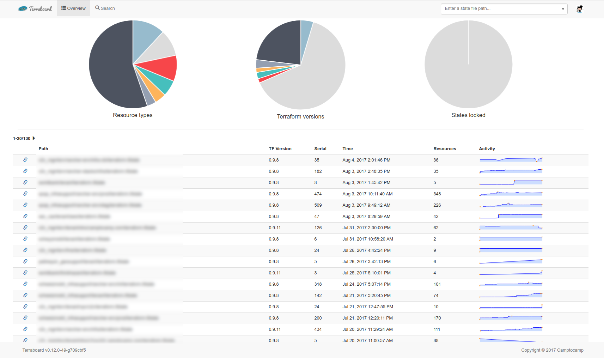
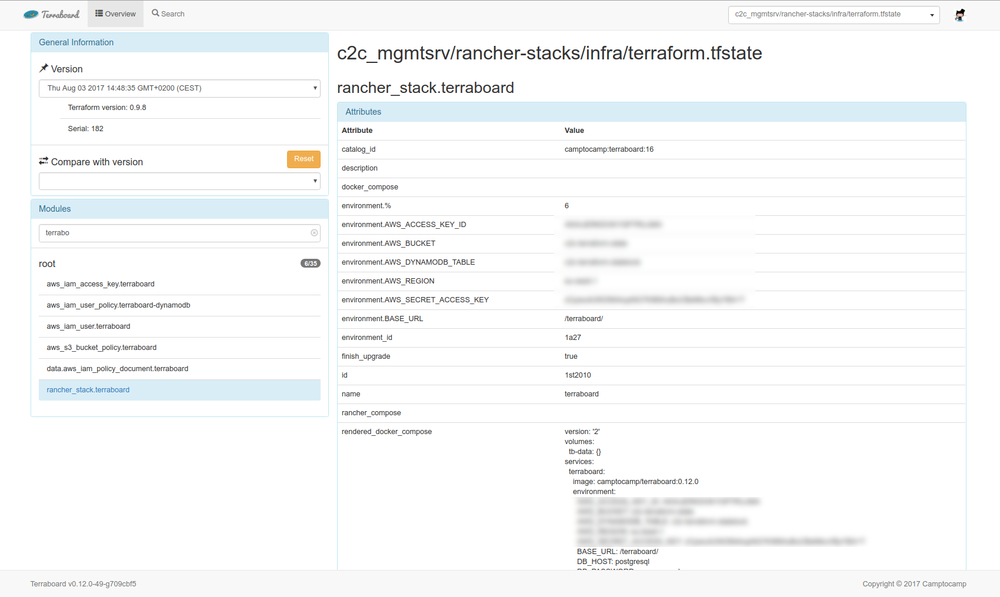

# Terraboard

Web Dashboard to inspect Terraform States


[](https://hub.docker.com/r/camptocamp/terraboard/)
[](https://goreportcard.com/report/github.com/camptocamp/terraboard)
[](https://gitter.im/camptocamp/terraboard)
[](http://www.camptocamp.com)


## What is it?

Terraboard is a web dashboard to visualize and query
[Terraform](https://terraform.io) states.






### Requirements

Terraboard currently supports getting the Terraform states from AWS S3. It
requires:

* A **versioned** S3 bucket name with one or more Terraform states,
  named with a `.tfstate` suffix
* AWS credentials with the following rights on the bucket:
   - `s3:GetObject`
   - `s3:ListBucket`
   - `s3:ListBucketVersions`
   - `s3:GetObjectVersion`
* A running PostgreSQL database
* If you want to retrieve lock states
  [from a dynamoDB table](https://www.terraform.io/docs/backends/types/s3.html#dynamodb_table),
  you need to make sure the provided AWS credentials have `dynamodb:Scan` access to that
  table.


## Use with Docker

```shell
$ docker run -d -p 8080:8080 \
   -e AWS_REGION=<AWS_DEFAULT_REGION> \
   -e AWS_ACCESS_KEY_ID=<AWS_ACCESS_KEY_ID> \
   -e AWS_SECRET_ACCESS_KEY=<AWS_SECRET_ACCESS_KEY> \
   -e AWS_BUCKET=<terraform-bucket> \
   -e AWS_DYNAMODB_TABLE=<terraform-locks-table> \
   -e DB_PASSWORD="mygreatpasswd" \
   --link postgres:db \
   camptocamp/terraboard:latest
```

and point your browser to http://localhost:8080


### Authentication and base URL

Terraboard does not implement authentication. Instead, it is recommended to use
an authentication proxy such as [oauth2_proxy](https://github.com/bitly/oauth2_proxy).

If you need to set a route path for Terraboard, you can set a base URL by
passing it as the `BASE_URL` environment variable.


## Install from source

```shell
$ go get github.com/camptocamp/terraboard
```

## Development

### Architecture

Terraboard is made of two components:

#### A server process

The server is written in go and runs a web server which serves:

  - the API on known access points, taking the data from the PostgreSQL
    database
  - the index page (from [static/index.html](static/index.html)) on all other
    URLs

The server also has a routine which regularly (every 1 minute) feeds
the PostgreSQL database from the S3 bucket.

#### A web UI

The UI is an AngularJS application served from `index.html`. All the UI code
can be found in the [static/](static/) directory.


### Testing

```shell
$ docker-compose build && docker-compose up -d
# Point your browser to http://localhost
```

### Contributing

Please report bugs on the [GitHub project
page](https://github.com/camptocamp/terraboard/issues).

We welcome contributions in the form of [Pull
Requests](https://github.com/camptocamp/terraboard/pulls).


